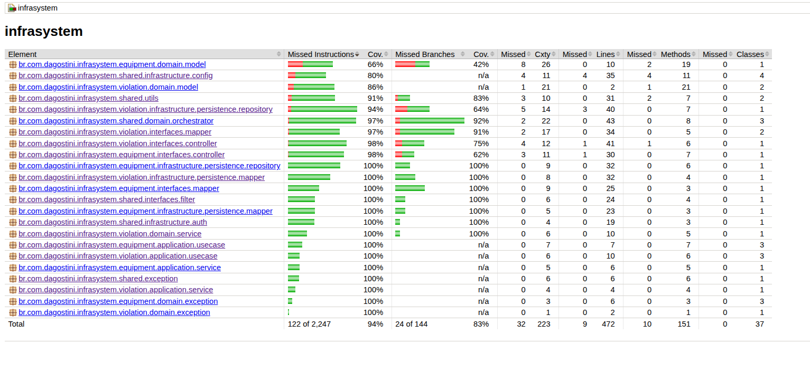
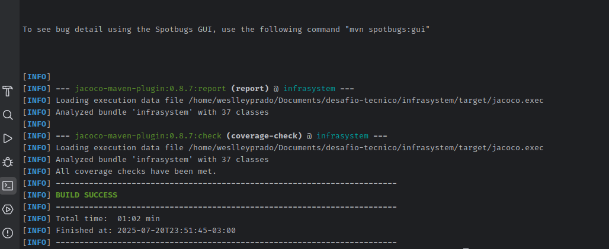

# Infra System

O **Infra System** é um projeto desenvolvido com **Domain-Driven Design (DDD)** e **Arquitetura Hexagonal**, utilizando **Java 17** e **Spring Boot 3.3.0**. O sistema gerencia equipamentos e infrações, integrando-se a um serviço que simula o **AWS S3** para armazenamento de imagens e a um serviço externo de autenticação para geração de tokens.

## Estrutura do Projeto


O projeto está organizado em dois **Bounded Contexts** principais: **Equipment** e **Violation**, seguindo os princípios da arquitetura hexagonal para garantir separação de responsabilidades. A estrutura de diretórios é a seguinte:

```
src/
└── main/
├── java/
│   └── br/com/dagostini/infraction/
│       ├── InfractionApplication.java      # Classe principal do Spring Boot
│
│       ├── shared/                         # Núcleo compartilhado (VOs, exceções, utilitários)
│       │   ├── domain/                     # Modelos e regras compartilhadas
│       │   ├── exception/                  # Exceções genéricas
│       │   ├── infrastructure/             # Implementações compartilhadas (ex.: configurações)
│       │   ├── interfaces/                 # Interfaces genéricas
│       │   └── utils/                      # Utilitários reutilizáveis
│
│       ├── equipment/                      # Bounded Context: Equipamentos
│       │   ├── domain/                     # Núcleo do domínio
│       │   │   ├── model/                  # Entidades, Value Objects e regras de negócio
│       │   │   ├── service/                # Serviços de domínio
│       │   │   ├── repository/             # Portas de saída (interfaces)
│       │   │   └── exception/              # Exceções específicas do domínio
│       │   ├── application/                # Casos de uso (portas de entrada)
│       │   │   ├── usecase/
│       │   │   └── service/
│       │   ├── infrastructure/             # Adaptadores secundários (JPA, armazenamento, etc.)
│       │   │   ├── persistence/
│       │   │   │   ├── entity/
│       │   │   │   ├── mapper/
│       │   │   │   └── repository/
│       │   │   └── storage/
│       │   └── interfaces/                 # Adaptadores primários (API REST, DTOs)
│       │       ├── controller/
│       │       ├── representation/
│       │       └── mapper/
│
│       ├── violation/                      # Bounded Context: Infrações
│       │   ├── domain/
│       │   │   ├── model/
│       │   │   ├── service/
│       │   │   ├── repository/
│       │   │   └── exception/
│       │   ├── application/
│       │   │   ├── usecase/
│       │   │   └── service/
│       │   ├── infrastructure/
│       │   │   ├── persistence/
│       │   │   │   ├── entity/
│       │   │   │   ├── mapper/
│       │   │   │   └── repository/
│       │   │   └── storage/
│       │   └── interfaces/
│       │       ├── controller/
│       │       ├── representation/
│       │       └── mapper/

```

## Configuração e Execução

Siga os passos abaixo para configurar e executar o projeto localmente.

### 1. Clonar o Repositório

Clone o repositório do projeto:

```bash
git clone https://github.com/Weslley-Prado/infrasystem.git
cd infrasystem

```

### 2. Executar com Docker Compose

O projeto utiliza **Docker Compose** para orquestrar o **PostgreSQL**, o sistema principal e o serviço que simula o **AWS S3**. Execute:

```bash
docker-compose up -d --build
docker-compose up

```

O sistema estará disponível em `http://localhost:8080`.

### 3. Configurar o Serviço de Autenticação

O sistema depende de um serviço externo de autenticação para gerar tokens JWT. Siga os passos abaixo:

#### a) Clonar o Repositório do Serviço de Autenticação

```bash
git clone https://github.com/Weslley-Prado/tokenmanager.git
cd tokenmanager

```

#### b) Executar o Serviço de Autenticação

```bash
docker-compose up -d --build
docker-compose up

```

#### c) Gerar um Token

Use o comando `curl` para obter um token de autenticação:

```bash
curl --request POST \
  --url http://localhost:8080/auth/login \
  --header 'Content-Type: application/json' \
  --data '{
    "username": "admin",
    "password": "admin123"
  }'

```

O token retornado deve ser incluído no cabeçalho `Authorization` (formato: `Bearer <token>`) para chamadas à API do sistema.

## Tecnologias Utilizadas

-   **Java 17**
-   **Spring Boot 3.3.0**
-   **PostgreSQL**
-   **Docker** e **Docker Compose**
-   **Serviço simulado de AWS S3** (armazenamento de imagens)
-   **Arquitetura Hexagonal** com **DDD**

## Coleções

As coleções de API, incluindo exemplos de requisições, podem ser encontradas no repositório:

-   [Weslley-Prado/collections](https://github.com/Weslley-Prado/collections)


## Pré-requisitos

-   **Java 17**
-   **Docker** e **Docker Compose**
-   **Git**
-   **cURL** (para chamadas de autenticação)

## Qual foi o aspecto mais difícil deste desafio e por quê?

O aspecto mais desafiador deste projeto foi lidar com a complexidade inerente à gestão de dois **Bounded Contexts** distintos, **Equipment** e **Violation**, dentro de uma mesma aplicação. A necessidade de manter a separação clara entre esses contextos, garantindo que cada um tivesse suas próprias regras de negócio, entidades e responsabilidades, exigiu um planejamento cuidadoso para evitar acoplamento indevido e preservar a coesão do sistema.

Inicialmente, considerei que a **Arquitetura Hexagonal**, por si só, poderia não ser suficiente para abordar toda a complexidade do domínio. Por isso, optei por combiná-la com os princípios de **Domain-Driven Design (DDD)**, que proporcionaram uma base sólida para modelar os contextos de forma clara e estruturada. O DDD foi especialmente útil para definir os limites dos contextos e organizar as regras de negócio, facilitando a escalabilidade e a manutenção do sistema.

Embora minha intenção inicial fosse evoluir o projeto para uma arquitetura de microsserviços, onde cada contexto poderia ser implementado como um serviço independente, comunicando-se por meio de um sistema de mensageria (como RabbitMQ ou Kafka), limitações de tempo devido a questões pessoais me impediram de realizar essa implementação. Apesar disso, acredito que a abordagem adotada, combinando DDD e Arquitetura Hexagonal, já oferece uma base robusta para suportar a escalabilidade e futuras expansões do sistema. Com mais tempo, a divisão em microsserviços seria uma evolução natural, permitindo maior desacoplamento e flexibilidade para lidar com os diferentes contextos.

Essa combinação de fatores — a complexidade dos contextos, a escolha estratégica da arquitetura e as restrições de tempo — tornou o desafio tecnicamente enriquecedor, exigindo decisões cuidadosas para equilibrar qualidade, funcionalidade e prazos.

##  Relatório de Cobertura 


## Resultado do mvn clean verify



## Contrato da API - Swagger

O contrato da API, definido em um arquivo OpenAPI/Swagger, pode ser encontrado no repositório do projeto. Para visualizá-lo:

-   Acesse o arquivo `contract-api.yaml` em:  
    [src/main/resources/contract-api.yaml](https://github.com/Weslley-Prado/infrasystem/blob/main/src/main/resources/contract-api.yaml)
- 
## Collections Insomnia

As coleções de API, incluindo exemplos de requisições, podem ser encontradas no repositório:

-   [Weslley-Prado/collections](https://github.com/Weslley-Prado/collections)

## Demonstração

Uma breve demonstração do sistema em funcionamento pode ser vista no vídeo a seguir:

-   [Demonstração do Infra System](https://youtube.com/shorts/dG8JWxdMwqY?si=8AiQHXM9OxcMXFTR)

## Contato

-   **Weslley Prado**: [weslleyrprado@gmail.com]
- **GitHub**: [Weslley-Prado](https://github.com/Weslley-Prado)